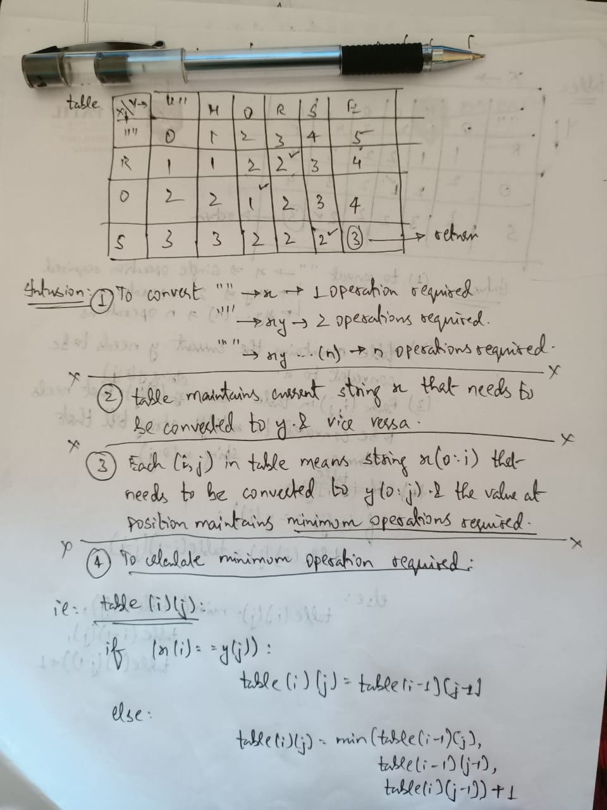
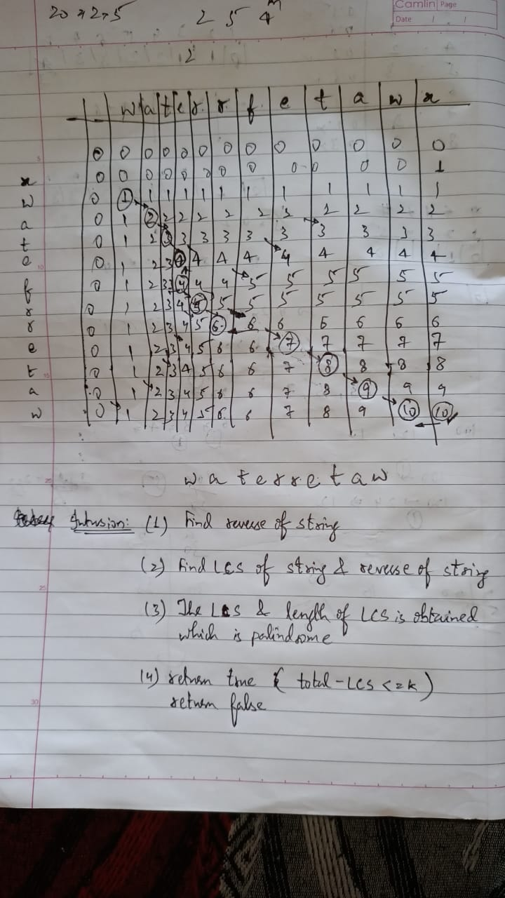

<link rel="stylesheet" href="https://cdnjs.cloudflare.com/ajax/libs/materialize/1.0.0/css/materialize.min.css">
<blockquote> <strong> <i> Those who cannot remember the past they are condemned to repeat it.<i></strong> </blockquote>

<h5><strong> 😫 <i> Try Some simple DP PROBLEMS . This makes you feel 😄  <i> <strong> <h5>

    <strong>Longest Common Subsequence : </strong><a href="https://leetcode.com/problems/longest-common-subsequence/">Link to problem</a>

    <strong>Shortest Common Supersequence : </strong><a href="https://leetcode.com/problems/shortest-common-supersequence/">Link to problem</a>
     
    Intution 🤔 👍 -->  
    <ol>
            <li>Try Finding out LCS string.
            <li>With the obtained LCS try integrating the non LCS character in such a way that they occur in the same order of their appearance in their desired strings.
            <li>The solution string is union of LCS and non LCS characters in order of their apprearance. 
    </ol>

    <strong>Longest Arithematic Progression : </strong><a href="https://practice.geeksforgeeks.org/problems/longest-arithmetic-progression/0">Link to problem</a>
     
    Intution 🤔 👍 💯 -->  
    <ol>
            <li>Try to figure out O(n*n) Logic with a hint of storing the common difference between each pair of elements when iterated. 
            <li>Try to build a Hash Map dynamically from index (1:size of array) in such a way that Hash Map stores the elements of type {key(common difference):value(counter)} which is referenced for each pair from previously iterated index.
            <li>Try to find out the max counter present in the Hash Map . The (max+1) will give you solution . Guess why?
            <li>Pairing elements helps you find the solution reason for adding 1 behind max is the same as one need to count elements that are paired together. 
    </ol>

    <strong>Edit Distance : </strong><a href ="https://leetcode.com/problems/edit-distance/">Leetcode</a> or <a href="https://practice.geeksforgeeks.org/problems/edit-distance/0">G4G</a>
     Intution: 
    
    
    
    

    <strong>Longest Palindromic Subsequence : </strong><a href ="https://leetcode.com/problems/longest-palindromic-subsequence/">Leetcode</a> 
     Intution: 
   <ol>
            <li>Similar to LCS.</li>
            <li>Just need to find LCS of string and reversed string and return length of LCS.</li> 
    </ol>

    <strong>Max Profit with atmost one Transaction : </strong><a href ="https://leetcode.com/problems/best-time-to-buy-and-sell-stock/">Leetcode</a> 
     Intution: 
   <ol>
            <li>Look for a stock in which you feel the profit can be maximized. How?</li>
            <li>Approach 1: Try Brute Force , i.e. , try designing an algorithm which helps you figure out the profit earned with each stock after selling them once they are bought!! Do you feel Brute Force is optimal enough??</li>
            <li>Approach 2: Can you figure out how to optimize? Hints:  
                <ol type='i'>
                        <li>Work by maximizing the difference between buying and selling.</li>
                        <li>Can you work with finding a Minimum valued stock and iterating with that stock to all other stocks to find out the maximum absolute differece? </li>
                        <li>Can you do the above task simply while iterating the vector/array once?</li>
                        <li>Biggest Hint for above task : try implementing Priority Queue.</li>
                </ol>
            </li> 
    </ol>

    <strong>Max Profit with K Transactions : </strong><a href ="https://www.algoexpert.io/questions/Max%20Profit%20With%20K%20Transactions">AlgoExpert.io</a> 
     Intution: 
    

        <strong>K-palindrome : </strong><a href ="https://practice.geeksforgeeks.org/problems/k-palindrome/1">G4G</a> 
         Intution: 
        

        <strong>Unique Binary Search Trees : </strong><a href ="https://practice.geeksforgeeks.org/problems/unique-bsts/0">G4G</a> or <a href='https://leetcode.com/problems/unique-binary-search-trees/'>Leetcode</a> 
          <a href='./pdf/uniqueBSTwithCatlanNumbers.pdf'> Intution</a> 

        <strong>Coin Change 2 : </strong>
        <a href='https://leetcode.com/problems/coin-change-2/'>Leetcode</a> 
          <a href='./pdf/coin change ways.pdf'> Intution</a> 

##### Longest Valid Parenthesis : [Leetcode](https://leetcode.com/problems/longest-valid-parentheses/)

Intution 👍 🤔 :

<ol>
<li> Think of a stack implementation for the problem checking a pair of valid parenthesis.
<li> The best part is trying to visualize and implement the solution to check for a substring.
<li> Hint : Can you work with Visited Array anyhow??  
 </ol>

#### Increasing Triplet Subsequence : [Leetcode](https://leetcode.com/problems/increasing-triplet-subsequence/)

Intution 🤔 :

<ol>
<li>Think of first Brute Force Solution?
<strong>_Hint : O(n^2) Time and O(n) space_</strong>
<li>Try to optimize using a <strong>oneMin</strong> and <strong>twoMin<strong> representing the element which is Minimum till count is either one or two.
<li>Can you optimize Brute Force to O(n) Time and O(1) space using the above two variables?
<li> <strong> Hint: </strong> Solution will be 'true' once the element in the present index > twoMin
</ol>
